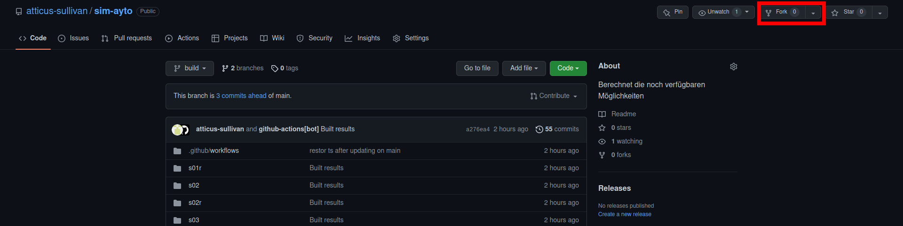
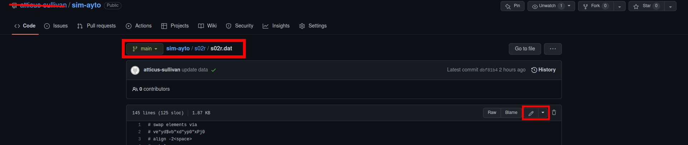
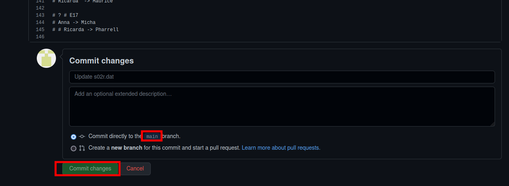
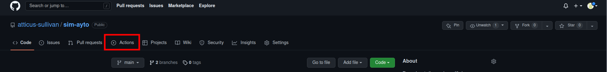
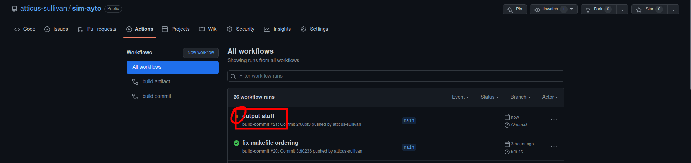
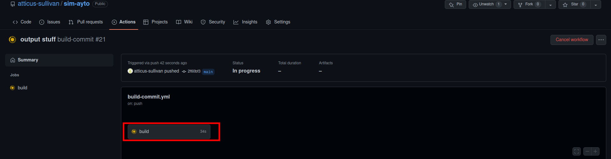
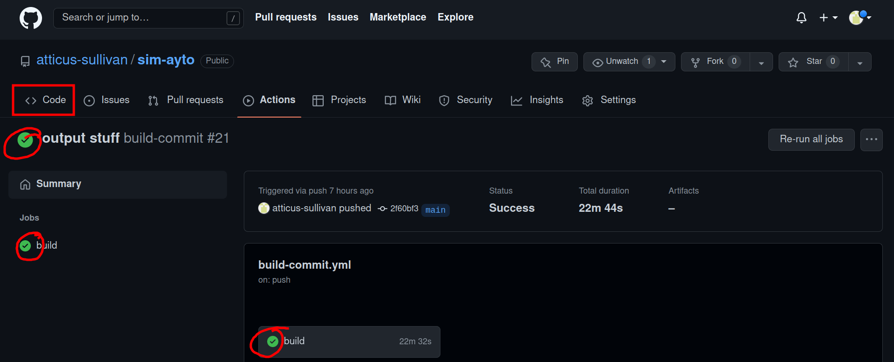

# sim-ayto
Berechnet die noch verfügbaren Möglichkeiten

# Ergebnisse

Um zu den Ergebnissen zu kommen, muss man zunächst auf den `build` Branch
wechseln).

Dann sind die Tabellen/Bäume unter `<Staffel>/<Staffel>*.{png,pdf,out}` zu finden
(bei Problemen hilft wahrscheinlich entweder Seite neu laden oder auf `Download`
(-> Datei wird je nach Browser direkt im Browser geöffnet) klicken)

## Ausgabe-Dateien
- `<Staffel>.out`: Hier findet man die meisten Informationen (u.A. den
  bisherigen Verlauf). 
  Vor der jeweiligen Tabelle kommt immer nochmal was genau
  als Einschränkung/Constraint dazu kam (die Zahl die da im Leeren steht ist die
  Anzahl der Lichter). Die Episode bezieht sich immer auf die Episode in der das
  ganze aufgelöst wurde. 
  Bei den Boxes wird immer der optimale Case rausgesucht
  (sollte immer der Case sein, der am nächsten zu den 100% ist) auch wenn das
  rein aus Informationstheoretischer Sicht ist (in der die Zahlen wirklich als
  Wahrscheinlichkeiten betrachtet werden). 
  Das ganze `I` (Informationsgehalt) /
  `H` (Entropie) geht auch in die informationstheoretische-Richtung
  (die Bits Information addieren sich auf, `x bits left` sage wieviel
  Information noch fehlt um das Ergebnis sicher zu wissen). Informationsgehalt
  ist vielleicht ganz interessant, weil sie ja immer davon reden, dass sie neue
  Erkenntnisse haben, auch wenn sie nix gefunden haben. Der Informationsgehalt
  sagt ob das wirklich so ist (aber eigentlich auch nur eine Umrechnung wie viel
  Möglichkeiten rausgeflogen sind im Verhältnis dern übrigen Möglichkeiten). Die
  Entropie wird derzeit glaube ich noch **falsch berechnet** (ist aber eh nicht
  so gut intuitiv zu erklären). 
  Neue Zeile -> neue Box/Night
- `<Staffel>.{pdf,png}`: Baum mit den noch übrigen Möglichkeiten. Die erste
  Zeile im Knoten ist immer der "Key" der auf der Ebene angeschaut wird
- `<Staffel>_tab.{pdf,png}`: Tabelle mit den noch übrigen Möglichkeiten

# Selbst rumprobieren
Da die Ergebnisse automatisch gebaut werden, könnt ihr auch ein wenig rumspielen
(halt nicht richtig interaktiv, aber mehr als die Website (+ Account) braucht ihr nicht)

1. Github Account erstellen
2. Projekt `fork`en
   
4. Hier kommt noch eine Seite dazwischen, da könnt ihr z.B. dem Projekt nen andren Namen geben
   unter dem es bei euch laufen soll
3. Github actions aktivieren (automatisches Ergebnisse bauen) 
   Ab hier ist das alles in eurem eigenen Repository
   
4. Datei mit den Daten (`.dat`) editieren (falls Ergebnisse schon angeschaut, muss hier
   wieder auf den `main` Branch gewechselt werden, funktioniert genauso wie auf
   den `build` Branch wechseln)
   
5. Datei speichern
   
6. Status vom Ergebnisse baun anschaun (nicht unbedingt notwendig)
   
   
   
   Das kann ein wenig dauern (~1 min)
   
   Fertig (war erfolgreich, falls hier n rotes `x` ist, ist was schief gelaufen, wenn 
   ihr auf `build` klickt und `build results files` aufmacht seht ihr vielleicht wo der
   Fehler ist)
7. Ergebnisse anschaun, hierzu wieder branch wechseln
   
   Ergebnisse liegen jetzt unter `<Staffel>/<Staffel>*.{png,pdf,out}`

## Eingabe-Dateien
- `<Staffel>.dat`:
  - Alles hinter einem `#` ist ein Kommentar und wird später
    ignoriert
  - Fängt an mit den Teilnehmern
  - Dann mit leeren Zeilen getrennte Einschränkungen/Constraints. Die bestehen
	immer aus `<Lichter> [<Name>] [<flags>]` in der ersten Zeile (Name und flags
	sind optional) und anschließend die jeweiligen Mappings (`nameA -> nameB`)
  - Boxes werden genau gleich wie Nights eingetragen, nur dass es nur ein Mapping
	gibt und die Lichter 0 -> noMatch oder 1 -> Match ist
  - Flags: zur Zeit gibt es folgende Flags:
  	<!-- - `t` (tree):  -->
  	- `f` (final): beim ersten final wird im output ein Marker `====` vorher
	  ausgegeben um das ganze vom bisherigen zu Trennen. Idee ist wenn sie es
	  nicht geschafft haben kann man das/die echte/-n rightige/-n Matching/-s angeben
  	- `c` (count): Verhindert, dass der Constraint mitgezählt wird (bei #MN/#MB)

## Anmerkungen
- Beim Eingeben von neuen Nights, vergisst man gerne die schon fest bekannten
  Matches. Einfach am Ende nochmal schaun ob es wirklich 10 Zeilen sind ;)
- An die Git(hub) Kenner, die Actions laufen nur mit dem `main` und `build`
  Branches, diese also nicht umbenennen (und nicht wundern wenns nicht klappt für
  neue Branches).

# "Kontakt"
Falls irgendwas nicht passen sollte, ihr was nicht versteht oder andere Anmerkungen habt, könnt ihr mir oben unter `Isues` hier auf Github eine Nachricht schreiben (wenn ihr auch einen Github Account habt).
