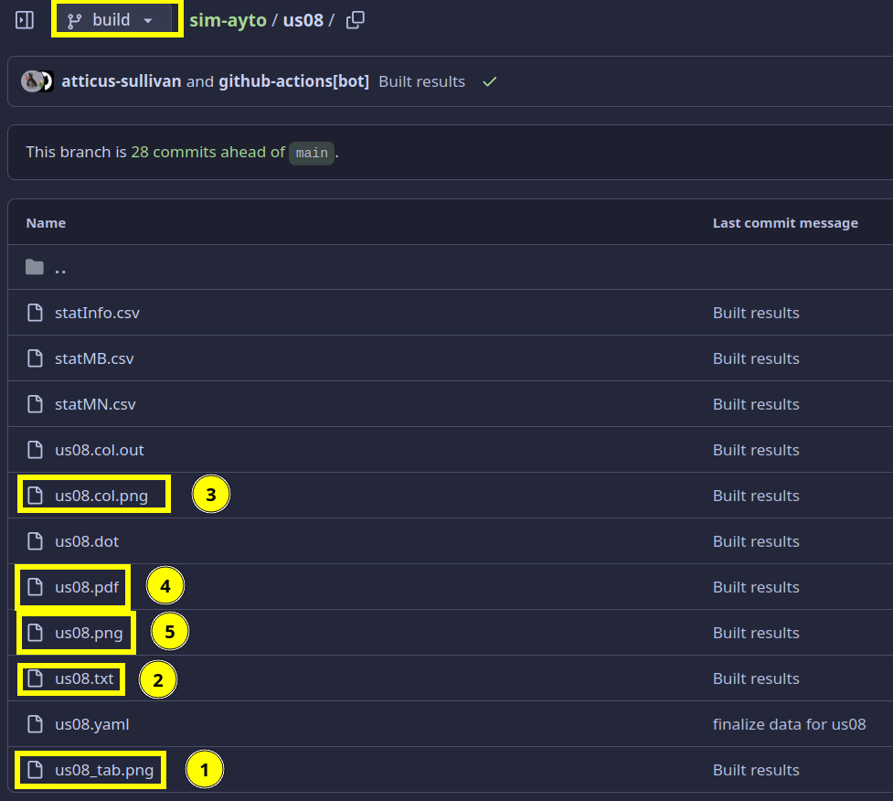

# sim-ayto
Berechnet die noch verfügbaren Möglichkeiten

# Ergebnisse
<details><summary>Um die Ergebnisse anzusehen, muss man zunächst auf den `build` branch wechseln:</summary>


Anschließend finden sich in den Ordnern der jeweiligen Staffel die Ausgabedateien

</details>

## Ausgabe-Dateien
<details><summary>Auflistung der (für die meisten) interessanten Ausgabedateien:</summary>



### 1. `<Staffel>_tab.png`
ganz klassisch die Tabelle mit den noch übrigen Möglichkeiten
#### 2. `<Staffel>.out`
Hier findet man die meisten Informationen (u.A. auch der komplette bisherige Verlauf der Tabellen).

Vor der jeweiligen Tabelle kommt immer nochmal was genau als Einschränkung/Constraint dazu kam. Die genannte Episode bezieht sich dabei immer auf die Episode in der das ganze aufgelöst wurde.

Das ganze `I` (Informationsgehalt) / `H` (Entropie, steht hinter wie viele Möglichkeiten noch übrig sind) ist der Versuch einzuschätzen wie viel eine Entscheidung gebracht hat und wie weit sie noch vom Ziel entfernt sind. Das ganze kommt aus der Informationstheorie.

`Pr[lights]`: Zeigt an wie Wahrscheinlich welche Anzahl an Lichtern ist nachdem festgelegt wurde wer in die Matchbox geht / miteinander sitzt (aber das Ergebnis eben nocht nicht bekannt ist).

`E[lights]`: Ist der Erwartungswert, wieviele Lichter im Schnitt angehen sollten.

#### 3. `<Staffel>.col.png`
Dasselbe wie 2. aber die Tabellen in Farbe.

#### 4./5. `<Staffel>.pdf` `<Staffel>.png`
Zeigt den Baum mit den noch verbliebenen Möglichkeiten an. Ist nur sinnvoll wenn nicht mehr so viele Möglichkeiten übrig sind (und kann auch nur dann generiert werden).

In diesem Baum ist die erste Zeile auf einer Ebene immer fest.

#### `stats.pdf`
Diese Datei liegt direkt im Hauptverzeichnis und enthält ein paar Statistiken um die Staffeln (basierend auf dem Informationsgewinn durch eine Matchox/einer Matchingnight und der Entropie) zu vergleichen.

</details>

# Selbst rumprobieren
Da die Ergebnisse automatisch gebaut werden, könnt ihr auch ein wenig rumspielen
(halt nicht richtig interaktiv, aber mehr als die Website (+ Account) braucht ihr nicht)

<details><summary>Anleitung</summary>

1. Github Account erstellen

2. Projekt `fork`en sodass ihr euere eigene Kopie von dem Projekt habt an dem ihr arbeiten könnt.
   
   
3. Hier kommt noch eine Seite dazwischen, da könnt ihr z.B. dem Projekt nen andren Namen geben
   unter dem es bei euch laufen soll. Wichtig dabei ist, dass ihr den Haken bei `copy main branch only` wegmacht.
   
   
4. Github actions aktivieren (das ist der Mechanismus, der die Ergebnisse automatisch generiert)
   

5. Ab jetzt ist alles fertig eingerichtet und sobald ihr eine Datei in dem Projekt ändert, werden die entsprechenden Ergebnisse automatisch generiert.

6. Eingabedateien ändern. Hierbei ist es wichtig, dass ihr das auf dem `main` Branch macht. Das wechseln funktioniert genauso wie auf
   den `build` Branch wechseln beim Ergebnisse anschauen.
   
   
   
   

7. Datei speichern
   
   

8. Status vom Ergebnisse generieren anschaun (nicht unbedingt notwendig)
   

   Hier seht ihr ein Beispiel von einem erfolgreiehn durchlauf. Normalerweise wird bei euch der Schritt 1 länger dauern (das hängt ganz von den Änderungen ab die ihr gemacht habt). Die Schritte unter 2 brauchen aber nur beim ersten Durchlauf so lange und sind in allen weiteren Durchläufen deutlich schneller.
   

   Bei Problemen sollte idR Schritt 1 fehlgeschlagen haben. Wenn ihr das aufklappt, findet ihr evtl raus was genau das Problem war (ihr könnt mir aber auch gerne [hier]([https://github.com/atticus-sullivan/sim-ayto/issues](https://github.com/atticus-sullivan/sim-ayto/discussions/categories/q-a)) schreiben in dem Fall.
   
9. Nachdem die Ergebnisse erfolgreich generiert wurden, sollte es in etwa so aussehen:
   

   Wenn anstelle des grünen Hakens ein rotes X ist, ist beim generieren etwas schief gelaufen und ihr könnt wie in 8. beschrieben nachschaunen was genau das Problem war.
   
   Die Ergebnisse könnt ihr euch jetzt wie oben unter [Ergebnisse](#Ergebnisse) beschrieben anschauen.

</details>

## Eingabe-Dateien
Zusätzlich zu der folgenden "Dokumentation" ist es sinnvoll (evtl reicht es sogar aus) sich die Eingabedateien `*.yaml` vergangener Staffeln anzuschauen.

<details><summary>Beschreibung des Dateiformats staffel.yaml </summary>

  Allgemein gilt: Alles hinter einem `#` ist ein Kommentar und wird später ignoriert.

### Allgemeine Eingaben
#### setA/setB
Diese beiden Keys (`setA` und `setB`) geben die Teilnehmer der beiden Gruppen an.

#### rule_set
Mittels `rule_set` kann angegeben werden mit welchen Regeln die Sendung verläuft.

Mögliche Regeln:
- `rule_set: !Eq`: Kein Doppelmatch (bisher) enthalten

- `rule_set: !FixedDup <dup>`: Es gibt ein Doppelmatch. Eine Person aus dem Doppelmatch (`<dup>`) ist bereits bekannt. Diese muss aus `setB` kommen (bei Bedarf müssen die beiden sets leider vertauscht werden).

- `rule_set: !SomeoneIsDup`: Es gibt ein Doppelmatch. Weiter ist über dieses Doppelmatch jedoch nichts bekannt. Die beiden Doppelmatch personen müssen aus `setB` kommen (bei Bedarf müssen die beiden sets leider vertauscht werden).

- `rule_set: !FixedTrip <tripA>`: Gleich wie `FixedDup` nur, dass eine Person aus `setA` drei Matches aus `setB` hat von denen eine Person (`tripA`) bekannt ist.

- `rule_set: !SomeoneIsTrip`: Analog wie `FixedTrip` ist dies das pendant zu `SomeoneIsDup`.

- `rule_set: !NToN`: Jeder kann mit jedem ein Match sein. Hier gibt es ein paar Besonderheiten zu beachten.
  - `setA` und `setB` müssen in diesem Fall genau identisch sein.
  - Achtung: Abhängig von der Anzahl an Personen dauert die Berechnung hier deutlich länger

### Matchboxen und Matchingnights
Matchboxen und Matchingnights werden beide als `constraint` eingegeben

#### type
Dieses Feld bestimmt ob dieser constraint eine Matchbox oder Matchingnight ist.
- `type: !Box {num: 9, comment: "E11"}`: `num` kann auch `9.1` sein (sollte aber nicht größer oder gleich `x.5` sein, sonst macht das die Statistik mit anderen Staffeln kaputt). `comment` kann ein beliebiger string sein.

- `type: !Night {num: 9, comment: "E11"}`: Analog zur `Box`

#### check
Gibt an auf welche Art hier vergleichen wird.
- `check: !Lights [6]`: `6` Lichter waren an

- `check: !Eq`: Die Personen die in `map` als *values* angegeben sind haben dasselbe Match, welches das ist, ist bleibt aber unbekannt (der *key* ist dabei egal).

#### map
Hier wird angegeben wer mit wem in die Matchbox gegangen ist bzw wer mit wem in der Matchingnight saß.
Angegeben wird das ganze als *key-value* pair bei dem der *key* aus `setA` und der *value* aus `setB` kommt.

Beispiel:
```yaml
      Sabrina: Mike
      Paulina: Danilo
      Kim: Paco
      Alicia: Steffen
      Jenny: Marvin
      Steffi: Teezy
      Darya: Emanuell
      Marie: Fabio
      Shakira: Peter
      Sandra: Elia
```

#### weitere optionale Felder
##### hidden
- `hidden: true`: verhindert die Ausgabe einer Tabelle für diese Entscheidung.
- wenn nicht angegeben, ist `hidden: false` der standard.

##### noExclude
Mit dem Hinzufügen von Doppelten Matches, kann ein Perfect-Match auch bedeuten, dass andere Matches explizit nicht mehr stattfinden.
Daher werden bei einer Matchbox mit "einem Licht" (aka Perfect-Match) über den `exclude` key automatisch Paare ausgeschlossen werden.

Sollte dies unerwünscht sein, kann der entwerder `noExclude: true` gesetzt werden oder der `exclude` manuell gesetzt werden (bei letzterem ist ist die syntax aber etwas komplizierter).

Wenn nichts angegeben wird ist `noExclude: false` der Standard.
   
  </details>

## Anmerkungen
- Damit die Statistik stimmt, darauf achten, dass falls mehrere Einträge zusammen gehören die ersten die sind, die geskippt werden (mit `hidden: true`) beim Zählen

- Beim Eingeben von neuen Nights, vergisst man gerne die schon fest bekannten Matches. Einfach am Ende nochmal schaun ob es wirklich 10 Zeilen sind ;)

- An die Git(hub) Kenner, die Actions laufen nur mit dem `main` und `build` Branch, diese also nicht umbenennen (und nicht wundern wenns nicht klappt für neue Branches).

# Kontakt
Falls irgendwas nicht passen sollte, ihr was nicht versteht oder andere Anmerkungen habt, könnt ihr mir oben unter [Discussions](https://github.com/atticus-sullivan/sim-ayto/discussions/categories/q-a) hier auf Github eine Nachricht schreiben (wenn ihr auch einen Github Account habt).
